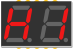
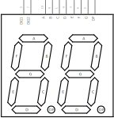

#  Two-digit 7-segment fritzing part

So far I only found 4-digit and 1-digit but the most common 7-segment display I can find around is 2-digit, and it has different layout so it's kinda hard to get correct PCB with this. I'm still not sure it is 100% correct, so contributions are welcome!

# Download

Navigate to the releases section and download latest release fzpz file. Here is [the link](https://github.com/ReDetection/2digit-7segment/releases/latest).

# Preview

 - Breadboard

 - Schematics

 - PCB

# Contributing

To be honest, fritzing part editor it's kind a weird. Recommended way is to import part into your Fritzing using fzpz file, then find it in parts list, right-click and edit. Once you done with your changes, export part to fzpz file, unpack it (it's regular zip-file), and submit contents as Pull Request. Or feel free to export your updated fzpz file and submit it as issue, I'll create pull request for you.

# License

MIT
